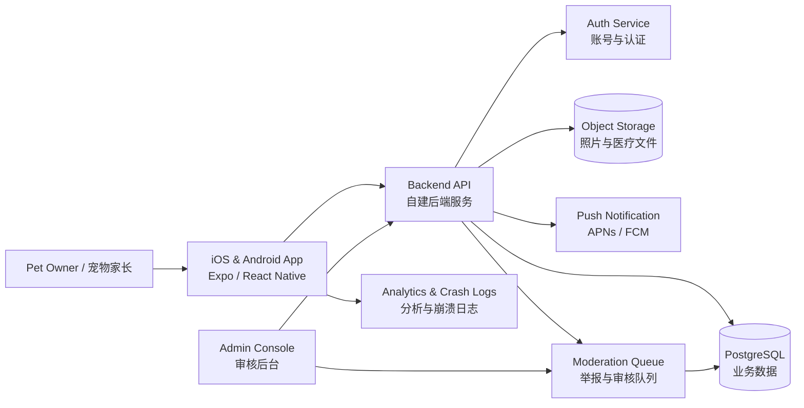
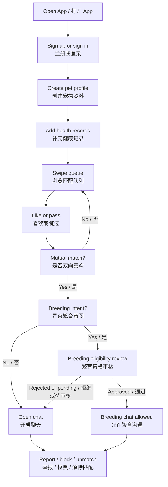
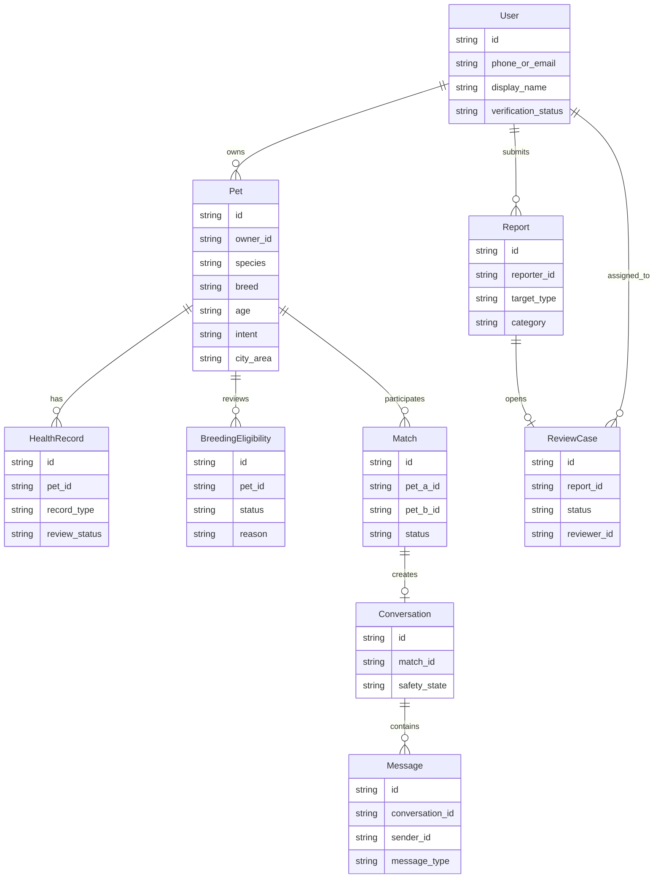
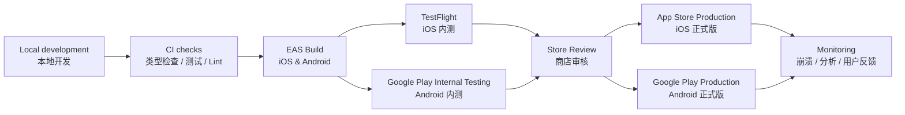

# LuckyPets Architecture / 架构设计

## Overview / 总览

LuckyPets is planned as a mobile-first pet matching product with responsible breeding guardrails. The long-term architecture uses an Expo/React Native client, a self-hosted backend API, PostgreSQL, object storage, push notifications, analytics/crash logs, and an admin console for moderation and breeding review.

LuckyPets 规划为移动端优先的宠物匹配产品，并把负责任繁育作为核心安全边界。长期架构采用 Expo/React Native 客户端、自建后端 API、PostgreSQL、对象存储、推送通知、分析/崩溃日志，以及用于内容审核和繁育资格审核的管理后台。

This document records the target architecture only. It does not declare implemented API contracts or database schemas yet.

本文只记录目标架构，不代表当前已经实现 API 契约或数据库表结构。

## System Context / 系统上下文

## Core Product Flow / 核心产品流程

## Domain Model / 领域模型

## Release Flow / 发布流程

## Module Boundaries / 模块边界

- Mobile App / 移动端：matching, messages, pet profile, health records, reporting, account deletion, notification preferences.
- Backend API / 后端 API：authentication gateway, pet profile service, matching service, chat service, moderation service, breeding eligibility service.
- Admin Console / 管理后台：review queue, report handling, breeding eligibility review, profile takedown, audit logs.
- Data Layer / 数据层：PostgreSQL for relational business data, object storage for pet photos and private health documents.
- Platform Services / 平台服务：APNs/FCM for push, analytics/crash logs for app quality, EAS for build and submit.

## Architecture Rules / 架构原则

- Use coarse location by default; never expose precise home location in public pet profiles.
- Keep medical documents private unless the owner explicitly shares them.
- Separate social/playdate matching from breeding intent and review.
- Require review before breeding chat is treated as approved or eligible.
- Keep moderation actions auditable.
- Design API and database contracts in a later implementation phase before building backend features.

## Related Documents / 相关文档

- [Product Roadmap](./product-roadmap.md)
- [Mobile Architecture Notes](./mobile-architecture.md)
- [Store Readiness Checklist](./store-readiness.md)
- [Product Plan](./product-plan.md)
- [Development Plan](./development-plan.md)
